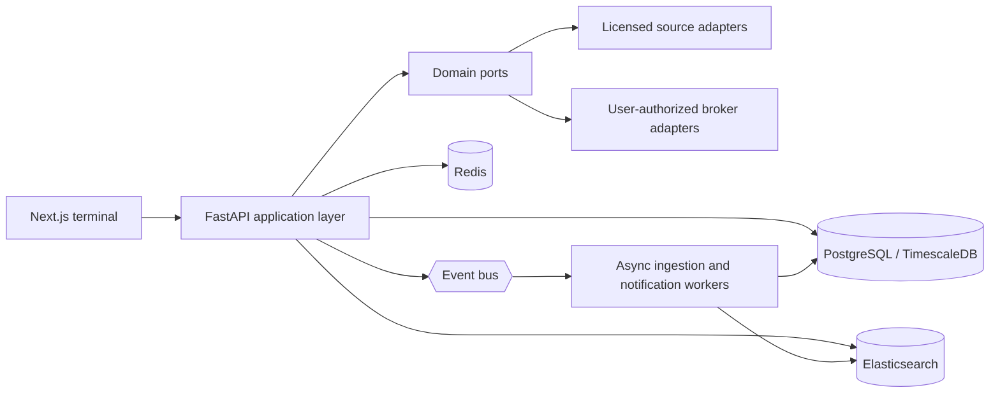

# Architecture

## Boundaries

The web application is a read-optimized terminal. The API owns domain orchestration and authorization. Data connectors implement ports; they do not leak vendor-specific response models into the UI.

## Extension rules

1. Add a port under `backend/app/domain/ports.py` when a capability needs an external dependency.
2. Add a mock adapter first; it is the contract-test oracle and keeps local development credential-free.
3. Add provider-specific adapters behind the port. Record source, retrieval time, licensing metadata, and content hashes for every ingested item.
4. Keep broker actions disabled unless the user has completed an authorized connection and explicit confirmation flow.

## Event model

Events should be immutable envelopes with `event_id`, `event_type`, `occurred_at`, `actor_id`, `workspace_id`, `schema_version`, and an idempotency key. Suggested topics include `market.price.updated`, `institutional.change.detected`, `portfolio.risk.changed`, `research.answer.created`, and `alert.dispatched`.
