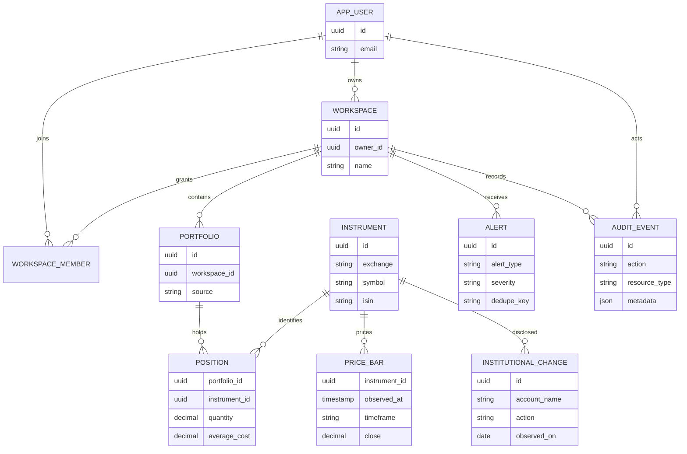

# Core ER diagram

```mermaid
erDiagram
  APP_USER ||--o{ WORKSPACE : owns
  APP_USER ||--o{ WORKSPACE_MEMBER : joins
  WORKSPACE ||--o{ WORKSPACE_MEMBER : grants
  WORKSPACE ||--o{ PORTFOLIO : contains
  PORTFOLIO ||--o{ POSITION : holds
  INSTRUMENT ||--o{ POSITION : identifies
  INSTRUMENT ||--o{ PRICE_BAR : prices
  INSTRUMENT ||--o{ INSTITUTIONAL_CHANGE : disclosed
  WORKSPACE ||--o{ ALERT : receives
  WORKSPACE ||--o{ AUDIT_EVENT : records
  APP_USER ||--o{ AUDIT_EVENT : acts

  APP_USER { uuid id string email }
  WORKSPACE { uuid id uuid owner_id string name }
  PORTFOLIO { uuid id uuid workspace_id string source }
  INSTRUMENT { uuid id string exchange string symbol string isin }
  POSITION { uuid portfolio_id uuid instrument_id decimal quantity decimal average_cost }
  PRICE_BAR { uuid instrument_id timestamp observed_at string timeframe decimal close }
  INSTITUTIONAL_CHANGE { uuid id string account_name string action date observed_on }
  ALERT { uuid id string alert_type string severity string dedupe_key }
  AUDIT_EVENT { uuid id string action string resource_type json metadata }
```
